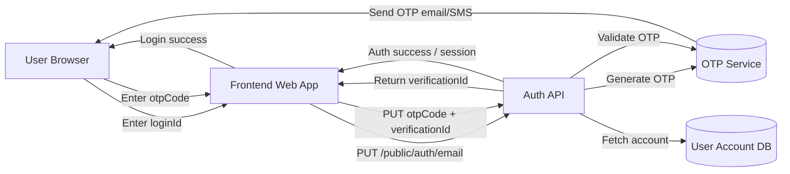
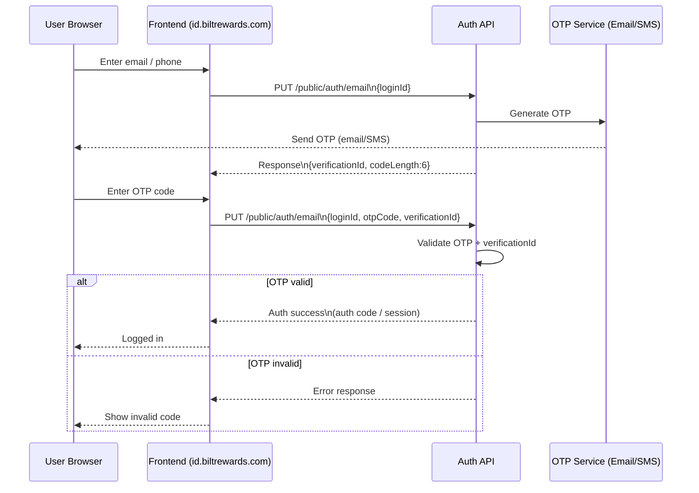

### Login Steps



----
---





>Conceptually the backend is doing something like:

```
if (otpCode == storedOTP && verificationId matches session)  
    allow login  
else  
    reject
```
>The **critical binding in this flow** is:

verificationId  → identifies the OTP challenge  
otpCode         → the secret user must provide  
loginId         → account being authenticated

All three must match for authentication to succeed. If any validation between those three objects is weak, authentication logic can break in subtle ways.


---


---
### Data Flows
```text
User → Frontend : loginId
Frontend → Auth API : /public/auth/email
Auth API → OTP Service : generate OTP
OTP Service → User : OTP message
Auth API → Frontend : verificationId
User → Frontend : otpCode
Frontend → Auth API : otpCode + verificationId
Auth API → DB : account lookup
Auth API → Frontend : session/auth code
```